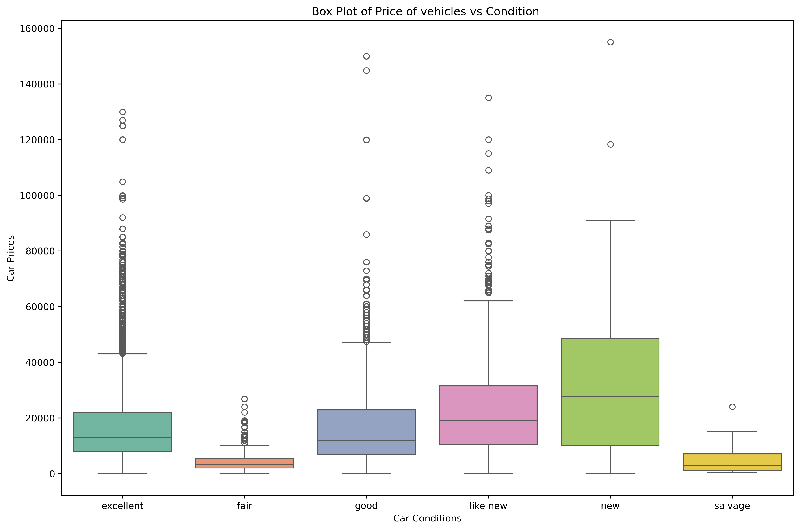
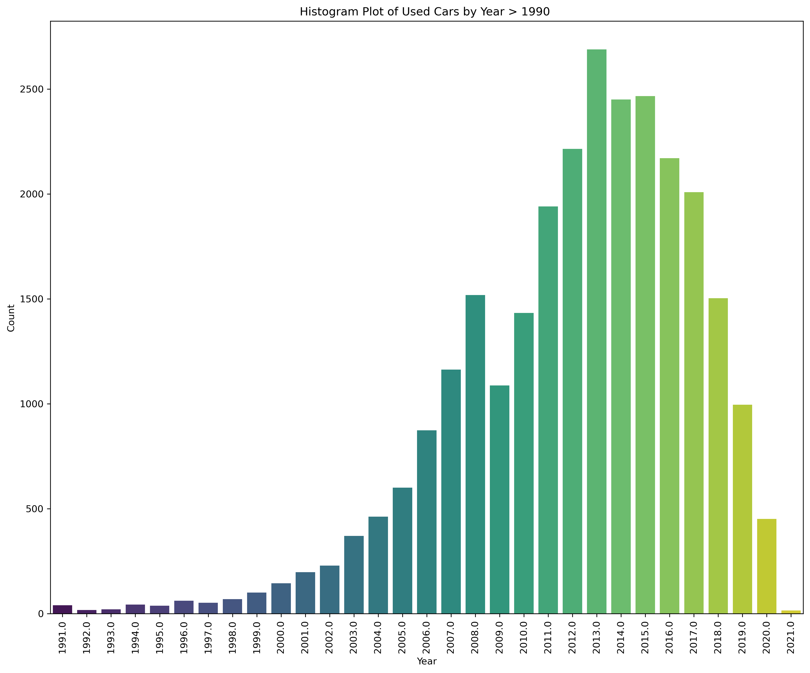
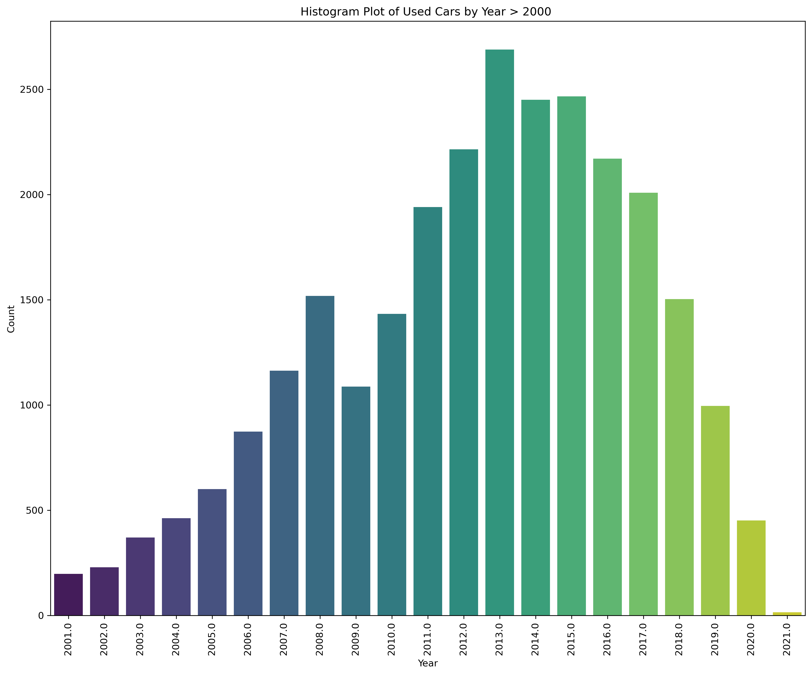

# Used Car Price Analysis Report

**Contents**

 * [Introduction](#Introduction)
 * [Project Structure](#Project-Structure)
 * [Contextual Intelligence](#Contextual-Intelligence)
 * [Data Understanding](#Data-Understanding)
 * [Data Preparation](#Data-Preparation)
 * [Regression Model](#Regression-Model)
 * [Findings](#Findings)
 * [Next steps and Recommendations](#Next-steps-and-Recommendations)

## Introduction

This repository contains the Jupyter Notebook for evaluating prcie of used car. This model takes used car data [vehicles.csv] file in the data folder of this repository to build a machine learning model application that evaluates if vehicles features like Fuel, Condition, Size, Type, Color etc. can be used to determine used car prices for the Car Dealership and Sales Team. This evaluation will help the Car Dealership with fine tuning their inventory by stocking cars that consumers are interested in.

## Project Structure
- `used_car_analysis.ipynb`: The complete technical analysis and modeling process.
- `README.md`: This report.
- `data/vehicles.csv`: The raw dataset.
- `images/`: Generated visualizations.

## Contextual Intelligence
The goal of this project is to pinpoint exactly what makes a used car sell. By identifying the specific features that drive value and demand, we are giving Car Dealers and Sales Teams a roadmap for their inventory. Instead of guessing what might move off the lot, you’ll have a data-backed strategy to stock the vehicles that will actually increase your sales.

How it Works
To get these insights, we used a "smart" computer model that learns from real-world market data. Here’s the breakdown of the process:

- **Preparation:** We gathered and polished a massive set of car data, removing any "noise" or errors to ensure the information is reliable.

- **The Learning Phase:** We "trained" our system to look at historical prices and features to find patterns—essentially teaching it what a "winner" looks like on the sales floor.

- **Testing & Accuracy:** We put the model to the test to ensure its predictions match reality, giving you confidence in the results.

  
## Data Understanding

To keep things transparent, the initial data we received wasn't quite "road-ready." We found several gaps and "too good to be true" entries that didn't reflect reality like vehicles listed for $0 or cars with only a single mile on the odometer. Before we could draw any real conclusions, we had to roll up our sleeves and scrub the data to ensure we weren't basing our business strategy on unrealistic numbers.

As you can see from the Diagram above, there are car prices with zero value for all conditions.

## Data Preparation

To keep our analysis accurate and focused on what actually drives sales, we refined the data using the following steps:

- Clearing Out Errors: Removed entries with unrealistic "zero" values for prices and mileage, as these would have skewed our results.
- Filling the Gaps: Filtered out any records that were missing key information, ensuring we only worked with complete and reliable profiles.
- Trimming the Noise: Stripped away technical identifiers like VINs and ID numbers—details that are necessary for paperwork but don't actually influence how much a customer is willing to pay.
- Evaluating Influence: Carefully reviewed features like color, manufacturer, and transmission type to determine which ones truly impact a car's market value and which ones shoppers tend to ignore.
- Focusing on the Modern Market: Narrowed focus to vehicles manufactured from 1990 onwards, as there wasn't enough data on older models to provide meaningful insights for your current inventory.

## Regression Models

To find the most accurate way to predict prices, we tested seven different versions of model. Here is how we refined those tests:

Testing Different Approaches: Built seven distinct versions of the model some used every available piece of information, while others focused only on the specific features that showed the strongest mathematical link to a car's price.

Narrowing the Scope: For several of these models, applied stricter filters focusing only on cars priced over $5,000, with more than 5,000 miles, and built after 1990—to see if focusing on this "core" market improved our results.

Finding the Winners: While most of the initial attempts had an accuracy rate below 50%, our final two models performed significantly better. You can see the comparison in the table below:

| Model Name  	| Description                                                                                                                      	| Accuracy Score (Training) 	| Accuracy Score  (Test) 	|
|-------------	|:----------------------------------------------------------------------------------------------------------------------------------	|:-------------------------:	|:----------------------:	|
| Model       	| Built with all features from data manipulation dataset                                                                           	| 44.54                     	| 43.09                  	|
| Model1      	| Odometer and Year as inputs from data manipulation dataset                                                                       	| 6.94                      	| 1.92                   	|
| Model2      	| Odometer and Price greater than 5000, Odometer and Year as inputs                                                                	| 12.45                     	| 12.54                  	|
| Model3      	| Odometer and Price greater than 5000, Year as the only input                                                                     	| 0.3                       	| 0.26                   	|
| Model4      	| Odometer and Price greater than 5000, odometer as the only input                                                                 	| -97.45                    	| -96.91                 	|
| Model6      	| Odometer and Price greater than 5000 with Odometer, Year, fuel_diesel, drive_4wd  and size_full-size as the only inputs              	| 45.26                     	| 46.88                  	|
| Model7      	| Odometer and Price greater than 5000 and  Year > 1990 with Odometer, Year, fuel_diesel,  drive_4wd and size_full-size as the only inputs 	| 47.52                     	| 48.26                  	|
|             	|                                                                                                                                  	|                           	|                        	|

Based on the scores, there is still some way to go to get to a model with a higher accuracy score with the highest score for training and testing data currently less than 50%

It's also not a coincidence that the highest score of 47.52% and 48.26% reflects the highest numbers for correlation between these features and price from the correlation matrix.

## Findings

In testing these models with the inputs, we observed the following for used car prices:

| Model Name  	| Test Description                                                                     	| Predicted Used Car Price ($) 	|
|-------------	|:--------------------------------------------------------------------------------------	|:----------------------------:	|
| Model       	| New car with 100 miles, condition excellent and new with diesel and four wheel drive 	| -98,263.87                   	|
| Model       	| New car with 100 miles, condition good and with Electric and front wheel drive       	| 29,013.33                    	|
| Model1      	| New car with 100 miles                                                               	| 21,112.15                    	|
| Model1      	| Old 2001 car with 90000 miles                                                        	| 17,566.90                    	|
| Model2      	| New 2022 Car with 100 miles                                                          	| 26,627.40                    	|
| Model3      	| Car with Year of 1980                                                                	| 18,540.07                    	|
| Model3      	| Car with Year of 2020                                                                	| 18,914.62                    	|
| Model4      	| Car with Odometer of 50000                                                           	| 5,919.20                     	|
| Model4      	| Car with Odometer of 100000                                                          	| 11,838.40                    	|
|             	|                                                                                      	|                              	|

Initial model attempted to account for every available detail—including mileage, year, condition, and engine type but it produced some confusing results. For example, when we tested a high-end scenario (a nearly new, excellent-condition diesel 4WD), the system actually predicted a negative value of -$98,263.87, which clearly doesn't happen in the real world.

However, that same model was much more realistic when looking at different categories, correctly valuing a new electric car with front-wheel drive at $29,013.33. This showed us that while the model was on the right track for some vehicles, it still needed more fine-tuning to handle every type of car accurately.

For ML Applications ``Model6`` and ``Model7`` which are the recommended/selected models, see below for the prediction testing results:

| Test Description                                                         	| Predicted Used Car Price Model6	| Predicted Used Car Price Model7 ($)	|
|:--------------------------------------------------------------------------	|:-------------------------------:	|:-------------------------------:	|
| Car with Year of 1940, 100k Miles with Diesel Fuel, 4WD and Full Size    	| 38,785.04                      	| 39,107.49                      	|
| Car with Year of 1990, 100k Miles with No Diesel Fuel, 4WD and Full Size 	| 22,417.60                      	| 22,569.71                      	|
| Car with Year of 2020, 10k Miles with Diesel Fuel, 4WD and Full Size     	| 47,456.98                      	| 48,238.24                      	|
| Car with Year of 2020, 10k Miles with No Diesel Fuel, 4WD and Full Size  	| 31,089.55                      	| 31,700.49                      	|
|                                                                          	|                                 	|                                 	|

With regards to high quality model based on the dataset provided, ``Model6`` and ``Model7`` are the recommended models.

When we analyze the importance of feature selection based on the trained model, we observe the following order
- ``Model6`` - Diesel Fuel, Odometer, Four Wheel Drive, Full Size and Year
- ``Model7`` - Diesel Fuel, Year, Odometer, Four Wheel Drive and Full Size

## Next Steps and Recommendations

As the data provided is not that clean with null, NAN, zero, missing and unrealistic values, further filering of the data could be done, for example, selecting used car records with year => 2000. 

To ensure we are giving model the best possible guidance, we have identified several clear paths to make our price predictions even sharper. By zeroing in on newer vehicles, the model can better weigh modern essentials like drivetrain, vehicle size, and engine configurations factors that tend to have a much heavier influence on the value of late-model, low-mileage cars. 

Prioritizing these details should push our accuracy well above the 50% mark. Beyond basic specs, we can further refine the AI by capturing the high-demand tech that today’s buyers actually prioritize, such as automated safety systems, advanced infotainment, and remote start capabilities. We also recommend simplifying complex categories like paint colors or regions into broader groups, which allows the model to process these details more efficiently without getting bogged down in minor variations. 

Based on our rigorous testing, we recommend moving forward with Model 6 and Model 7, as they currently provide the most reliable insights for your inventory planning.

These models were built with the following logic:
- ``Model6`` - Odometer and Price greater than 5000, Odometer, Year, fuel_diesel, drive_4wd  and size_full-size as the only inputs
- ``Model7`` - Odometer and Price greater than 5000, Odometer, Year > 1990, Year, fuel_diesel,  drive_4wd and size_full-size as the only inputs

These models  provided the following model feature selection:
- ``Model6`` - Diesel Fuel, Odometer, Four Wheel Drive, Full Size and Year
- ``Model7`` - Diesel Fuel, Year, Odometer, Four Wheel Drive and Full Size

For Next Steps, while the recommended models (i.e., ``Model7`` etc.) can be deployed, we would also recommend gathering more quality data that would produce a model with an accuracy of 75%+ based on used cars data no more than 10-15 years old.

Updated data should also provide a better indication on the latest features that consumers are looking for so that the Dealership can source these cars for their inventory.
